# Lab 3 — Gestión de Memoria

**Universidad de Antioquia · Ingeniería de Sistemas · Sistemas Operativos**

**Integrante:** Mateo Aguirre Duque — mateo.aguirre@udea.edu.co — CC 1152472114

**Video:** https://youtu.be/nfuaGV5BI1s

---

## 1. Espacio de Direcciones

### 1.1 Programa base — `mem_map.c`

El programa imprime el PID del proceso y la dirección virtual de cuatro variables que viven en regiones distintas: la función `main` (segmento de código), `global_var` (zona de datos), `local_var` (stack) y `heap_var` (heap). La idea es ver con un caso real dónde queda cada cosa en memoria.

Para compilar y ejecutar:

```bash
gcc -Wall -o mem_map mem_map.c
./mem_map
```

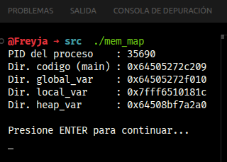

### 1.2 Visualización del mapa de memoria

Mientras `mem_map` queda esperando el ENTER, abrí una segunda terminal y corrí:

```bash
cat /proc/$(pgrep mem_map)/maps
pmap -x $(pgrep mem_map)
```

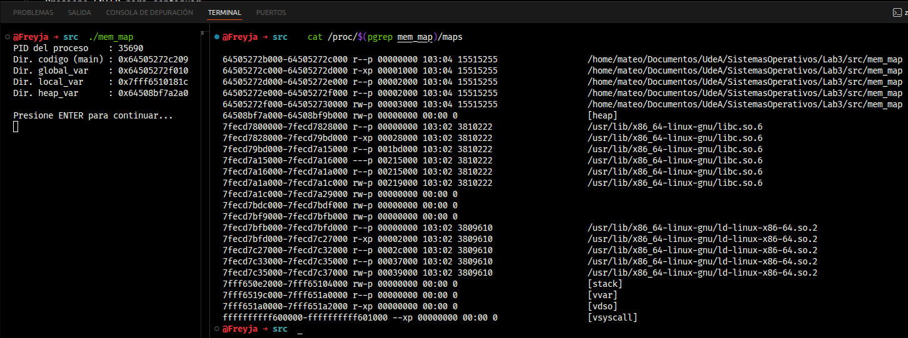

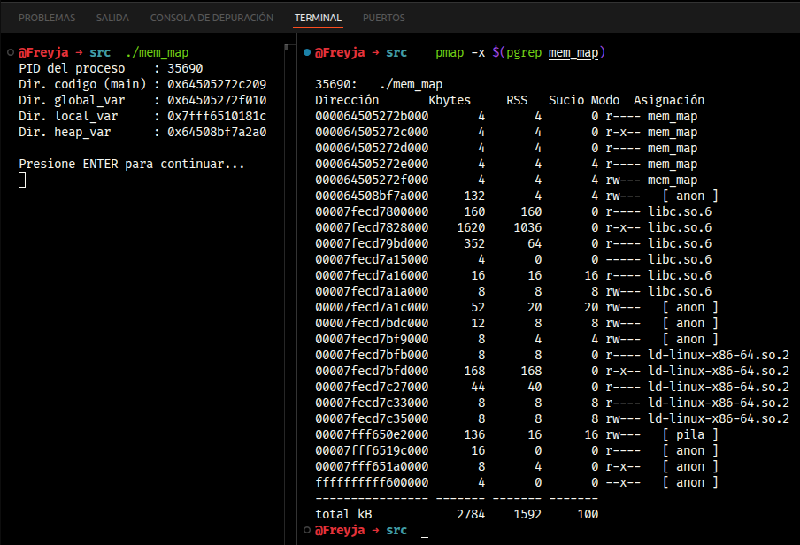

### 1.3 Exploración de `/proc/[pid]/maps`

La salida que obtuve del proceso (PID 35690) fue:

```
PID del proceso    : 35690
Dir. codigo (main) : 0x64505272c209
Dir. global_var    : 0x64505272f010
Dir. local_var     : 0x7fff6510181c
Dir. heap_var      : 0x64508bf7a2a0
```

**1. Permisos de cada región:**

| Región | Rango en /proc/maps | Permisos | Por qué |
|--------|---------------------|----------|---------|
| text (código) | `64505272c000-64505272d000` | `r-xp` | Es solo lectura y ejecución, no se puede escribir para que el programa no se modifique a sí mismo. |
| .data (global) | `64505272f000-645052730000` | `rw-p` | Tiene lectura y escritura porque las variables globales pueden cambiar de valor. No es ejecutable porque es data, no código. |
| heap | `64508bf7a000-64508bf9b000` | `rw-p` | Lectura y escritura, ya que `malloc` y `free` necesitan modificar libremente esta zona. |
| stack | `7fff650e2000-7fff65104000` | `rw-p` | También lectura y escritura. Aquí van las variables locales y los stack frames de cada llamada a función. |

Los permisos difieren porque cada región tiene un propósito distinto. Lo interesante es que la separación entre escritura y ejecución es una protección de seguridad: el hardware se encarga de que no se pueda ejecutar código desde el heap o el stack, lo que hace mucho más difícil ataques tipo buffer overflow donde se inyecta código en memoria de datos.

**2. A qué región pertenece cada variable:**

| Variable | Dirección | Cae en el rango | Región |
|----------|-----------|-----------------|--------|
| `main` | `0x64505272c209` | `64505272c000–64505272d000` | text (r-xp) |
| `global_var` | `0x64505272f010` | `64505272f000–645052730000` | .data (rw-p) |
| `local_var` | `0x7fff6510181c` | `7fff650e2000–7fff65104000` | stack (rw-p) |
| `heap_var` | `0x64508bf7a2a0` | `64508bf7a000–64508bf9b000` | heap (rw-p) |

Cada dirección cae justo dentro del rango que le corresponde, lo que confirma que efectivamente el SO le asigna a cada tipo de dato una región distinta dentro del espacio virtual.

**3. Otras regiones que aparecen:**

| Región | Función |
|--------|---------|
| `libc.so.6` | La librería estándar de C. Trae las implementaciones de `printf`, `malloc`, `free` y casi todo lo demás. Por eso aparece mapeada aunque uno no la haya cargado a mano. |
| `ld-linux-x86-64.so.2` | El *dynamic linker*. Es lo que se encarga de cargar las librerías compartidas al arrancar el proceso y resolver los símbolos antes de que `main` empiece a correr. |
| `[vvar]` | Una región de solo lectura donde el kernel expone variables (como el tiempo actual) para que se puedan leer desde espacio de usuario sin tener que hacer una syscall. |
| `[vdso]` | *Virtual Dynamic Shared Object*. Es un fragmento chiquito de código del kernel que se mapea en cada proceso para acelerar syscalls que se llaman muchas veces, como `gettimeofday`. Evita el costo del cambio de modo. |
| `[vsyscall]` | Es una versión vieja del vdso, fija en `0xffffffffff600000`. Hoy ya está deprecada pero todavía se mantiene por compatibilidad con binarios antiguos. |

**4. ¿Las direcciones virtuales son iguales a las físicas?**

No, definitivamente no. Lo que el programa imprime son **direcciones virtuales**: el SO junto con la MMU se encargan de traducirlas a direcciones físicas en cada acceso. Esto es justo la abstracción del *address space* que vimos en clase: cada proceso ve un espacio de direcciones que parece exclusivo y contiguo, pero por debajo el sistema lo está mapeando a páginas físicas que pueden estar en cualquier parte de la RAM. Por eso, dos procesos distintos pueden tener exactamente la misma dirección virtual sin chocar, porque cada uno se traduce a su propia página física.

### 1.4 Comparación de dos procesos simultáneos

Ejecuté `mem_map` dos veces al tiempo en dos terminales y comparé las direcciones que salieron en cada una:

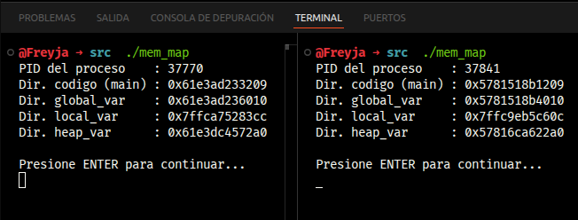

```
PID 37770:  main=0x61e3ad233209  global=0x61e3ad236010  local=0x7ffca75283cc  heap=0x61e3dc4572a0
PID 37841:  main=0x5781518b1209  global=0x5781518b4010  local=0x7ffc9eb5c60c  heap=0x57816ca622a0
```

**1. ¿Son las mismas direcciones virtuales?**

No, son distintas en ambos procesos. Esto pasa por **ASLR** (*Address Space Layout Randomization*), una técnica que hace el kernel para aleatorizar la base del espacio de direcciones de cada proceso. La razón es de seguridad: si las direcciones fueran predecibles, sería más fácil escribir exploits que dependen de saber dónde está cada cosa.

La conclusión es que cada proceso tiene su propio espacio de direcciones, totalmente privado y aislado. Aunque corra el mismo binario dos veces, cada instancia tiene su propio mundo virtual.

**2. ¿Podría el Proceso A leer o modificar la `global_var` del Proceso B usando su dirección virtual?**

No. Aunque ambos procesos tienen una variable que se llama igual, esas variables viven en páginas físicas completamente distintas. Si el Proceso A intenta acceder a la dirección virtual donde está `global_var` en el Proceso B, lo que va a pasar es que esa VA o no está mapeada en su propia tabla de páginas (y obtendría un *segmentation fault*) o apunta a su propia memoria, no a la del otro proceso. El SO garantiza este aislamiento; para compartir memoria entre procesos toca usar mecanismos explícitos como `mmap` con flag `MAP_SHARED` o memoria compartida POSIX.

---

## 2. API de Memoria

### 2.1 Programa base — `heap_demo.c`

El programa hace lo básico de la API de memoria en C: pide un arreglo de 10 enteros con `malloc`, lo amplía a 20 con `realloc` y al final libera con `free`. La idea es que sirva de referencia "limpia" antes de meterse al programa con bugs.

```bash
gcc -Wall -o heap_demo heap_demo.c
valgrind --leak-check=full --track-origins=yes ./heap_demo
```

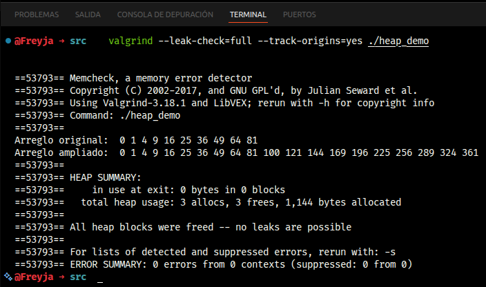

### 2.2 Uso correcto de `malloc` y `free`

**1. ¿Reporta errores Valgrind? ¿Qué significa "All heap blocks were freed"?**

No reporta nada. La salida termina con:

```
All heap blocks were freed -- no leaks are possible

...

ERROR SUMMARY: 0 errors from 0 contexts
```

El mensaje *"All heap blocks were freed"* significa que cada bloque de memoria que se pidió con `malloc` o `realloc` fue liberado con `free` antes de que el proceso terminara. Valgrind lleva un registro interno de cada bloque vivo en el heap y al final compara si quedó alguno sin liberar; como no quedó ninguno, garantiza que no hay fugas posibles.

**2. ¿Por qué se usa `sizeof(int)` y no el literal 4?**

Porque el tamaño de un `int` no es el mismo en todas las arquitecturas. En la mayoría de plataformas modernas son 4 bytes, pero en algunos sistemas embebidos puede ser de 2 e incluso podría ser distinto en arquitecturas exóticas. Si uno hardcodea un 4, el código se rompe al portarlo. Con `sizeof(int)` el compilador calcula el tamaño correcto para la arquitectura objetivo y uno no tiene que preocuparse.

**3. ¿Qué devuelve `malloc` cuando no hay memoria disponible y por qué hay que verificarlo?**

Devuelve `NULL`. Si uno usa el puntero sin haber verificado primero, el siguiente acceso es comportamiento indefinido: puede ser un *segmentation fault* o, peor, una corrupción silenciosa de memoria que se manifiesta mucho después y es muy difícil de debuggear. Por eso siempre se verifica antes de usar el puntero:

```c
int *arr = malloc(n * sizeof(int));
if (arr == NULL) { perror("malloc"); return 1; }
```

### 2.3 Código con bugs de memoria — `buggy_mem.c`

Este programa tiene los tres errores clásicos de manejo de memoria que pide el enunciado:

```bash
gcc -Wall -g -o buggy_mem buggy_mem.c
valgrind --leak-check=full --track-origins=yes ./buggy_mem
```

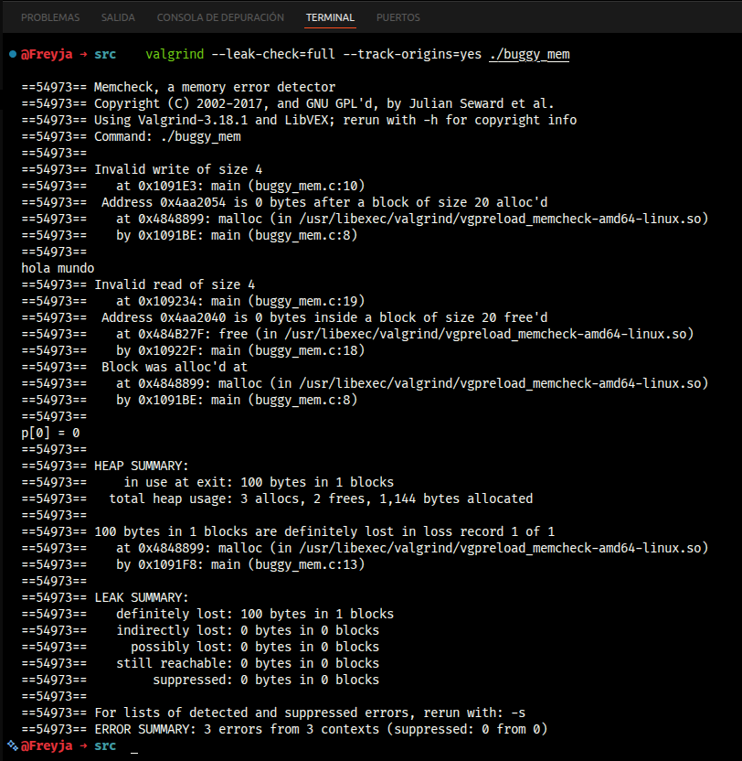

### 2.4 Identificar y corregir errores de memoria

**1. Mensajes de Valgrind y a qué error corresponde cada uno:**

| Error en el código | Mensaje de Valgrind | Línea |
|--------------------|---------------------|-------|
| **Buffer overflow** (`i <= 5` escribe en `p[5]`, fuera del bloque de 5 enteros) | `Invalid write of size 4` — `Address 0x4aa2054 is 0 bytes after a block of size 20` | `buggy_mem.c:10` |
| **Use-after-free** (el `printf` lee `p[0]` después de haber hecho `free(p)`) | `Invalid read of size 4` — `Address 0x4aa2040 is 0 bytes inside a block of size 20 free'd` | `buggy_mem.c:19` |
| **Memory leak** (`q` nunca se libera) | `100 bytes in 1 blocks are definitely lost` — asignado en `buggy_mem.c:13` | `buggy_mem.c:13` |

**2. Corrección en `buggy_mem_fixed.c`:**

Las tres correcciones que apliqué fueron:

1. Cambiar `i <= 5` por `i < 5` para no escribir fuera del bloque.
2. Mover el `printf("p[0]...")` antes del `free(p)`, así se lee la memoria mientras todavía es válida.
3. Agregar `free(q)` al terminar de usar el bloque de 100 bytes.

Después corrí Valgrind otra vez para verificar que ya no quedara nada:

```bash
valgrind --leak-check=full --track-origins=yes ./buggy_mem_fixed
```

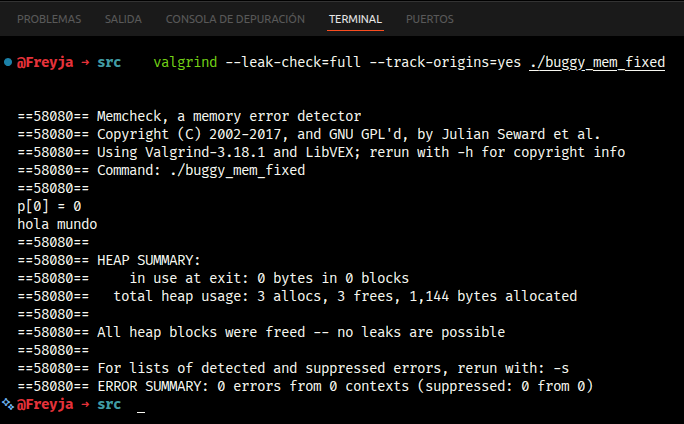

```
ERROR SUMMARY: 0 errors from 0 contexts
All heap blocks were freed -- no leaks are possible
```

Quedó limpio.

**3. Consecuencias de un use-after-free en un programa real:**

Un *use-after-free* es de los errores más peligrosos en C. Cuando uno hace `free` de un bloque, esa memoria queda disponible para que el allocator la entregue de nuevo en el próximo `malloc`. Si el programa todavía tiene un puntero hacia esa zona y la sigue usando, lo que va a estar leyendo o escribiendo en realidad pertenece a otro objeto. Las consecuencias pueden ser:

- **Corrupción silenciosa de datos**: el programa sigue ejecutando como si nada pero produce resultados incorrectos en cualquier momento.
- **Crashes intermitentes**: el bug se manifiesta solo a veces, dependiendo de cómo el allocator haya reciclado el bloque, lo que lo hace muy difícil de reproducir.
- **Vulnerabilidad de seguridad**: en programas reales, un atacante puede manipular el contenido del bloque reasignado para ejecutar código arbitrario. Esta clase de exploits se llama *heap exploitation* y es responsable de muchísimas CVEs en navegadores y kernels.

---

## 3. Traducción de Direcciones — Base & Bounds

### 3.1 Simulador — `base_bounds.c`

El simulador implementa la traducción `PA = VA + base`, válida solo cuando `0 ≤ VA < bounds`. Si la VA se sale del rango, en vez de devolver una PA imprime un mensaje de excepción. Definí tres procesos: A (`base=32, bounds=64`), B (`base=128, bounds=80`) y C (`base=0, bounds=32`), este último agregado como pide el punto 2 del análisis.

```bash
gcc -Wall -o base_bounds base_bounds.c
./base_bounds
```

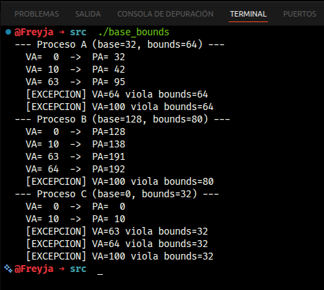

### 3.2 Base & Bounds — Análisis

**1. ¿Qué ocurre con VA=64 y VA=100 en el Proceso A?**

El Proceso A tiene `bounds=64`, entonces las VAs válidas van de 0 hasta 63. Cuando intenta traducir VA=64 ya estamos exactamente en el límite (recordar que el rango es `[0, bounds)` con bounds excluido) y VA=100 está mucho más allá, así que el simulador en ambos casos lanza la excepción:

```
[EXCEPCION] VA=64 viola bounds=64
[EXCEPCION] VA=100 viola bounds=64
```

En un SO real, lo que pasaría es que el hardware detecta la violación en el mismo ciclo de traducción y lanza una interrupción. El SO la atiende mandándole la señal `SIGSEGV` al proceso, lo que normalmente termina con el clásico mensaje *"Segmentation fault"*. Esto es justamente lo que protege a la memoria de otros procesos: no hay forma de que un programa pueda salirse de su rango sin que el hardware lo cache.

**2. ¿Puede el Proceso A acceder a las direcciones del Proceso C directamente?**

No, no puede. Aunque el Proceso C tiene `base=0` y por lo tanto sus PAs van de 0 a 31, el Proceso A genera siempre PAs desde 32 en adelante (porque su base es 32). Más importante todavía: en el modelo base & bounds cada proceso solo puede generar VAs dentro de su propio rango `[0, bounds)`. Cualquier VA fuera de ahí genera excepción antes incluso de llegar a calcular una PA. O sea que no existe ninguna VA que el Proceso A pueda usar para alcanzar la región física donde vive el Proceso C; el aislamiento es total.

**3. ¿Cuál es la limitación principal de base & bounds que motiva la segmentación?**

El gran problema de base & bounds es que trata el espacio de direcciones del proceso como si fuera un único bloque contiguo y de tamaño fijo. Esto trae dos problemas:

1. **Desperdicio de memoria física**: todo el rango entre `base` y `base+bounds` tiene que estar en RAM, aunque el heap esté casi vacío y el stack también. Todo el "hueco" intermedio entre ellos se desperdicia.
2. **Falta de flexibilidad**: no permite que el código, el heap y el stack tengan permisos distintos ni que crezcan de manera independiente.

La segmentación nace para resolver esto: en vez de un solo par base/bounds, cada segmento lógico (código, heap, stack) tiene su propio par. Así cada uno se puede ubicar en una zona distinta de la RAM y solo usa el espacio que realmente necesita.

---

## 4. Segmentación

### 4.1 Traducción manual con tabla de segmentos

El espacio de direcciones es de **14 bits**: los 2 bits más significativos son el selector de segmento y los 12 bits restantes son el offset.

| Segmento | Base (PA) | Tamaño | Crece | Selector |
|----------|-----------|--------|-------|----------|
| Code | 0x4000 | 2 KB (2048 B) | positivo → | 00 |
| Heap | 0x6000 | 3 KB (3072 B) | positivo → | 01 |
| Stack | 0x2800 | 2 KB (2048 B) | negativo ← | 11 |

Para los segmentos que crecen positivo, la fórmula es la normal: `PA = base + offset`, válida cuando `offset < tamaño`.

Para el Stack es distinto porque crece hacia abajo. La fórmula queda: `PA = base + offset − tamaño_máximo`, válida si `offset ≥ (tamaño_máximo − tamaño_asignado)`. En este caso el tamaño máximo coincide con el espacio de offset (12 bits = 4096 B), entonces queda `PA = 0x2800 + offset − 4096`, válido si `offset ≥ 2048`.

---

**Tabla de traducciones completa:**

| VA (hex) | Selector | Offset (hex) | Segmento | Cálculo | PA o Excepción |
|----------|----------|--------------|----------|---------|----------------|
| 0x03A0 | 00 | 0x3A0 = 928 | Code | 928 < 2048 ✓ → 0x4000 + 0x3A0 | **PA = 0x43A0** |
| 0x1800 | 01 | 0x800 = 2048 | Heap | 2048 < 3072 ✓ → 0x6000 + 0x800 | **PA = 0x6800** |
| 0x3C00 | 11 | 0xC00 = 3072 | Stack | 3072 ≥ 2048 ✓ → 0x2800 + 0xC00 − 4096 | **PA = 0x2400** |
| 0x0C00 | 00 | 0xC00 = 3072 | Code | 3072 ≥ 2048 ✗ | **EXCEPCIÓN** |
| 0x2200 | 10 | — | ??? | Selector 10 no tiene segmento asignado | **EXCEPCIÓN** |

---

**1. Cálculo paso a paso de cada VA:**

- **0x03A0** = `0000 0011 1010 0000`. Selector = `00` → Code. Offset = `0x3A0` = 928. Como 928 < 2048 (tamaño del segmento Code), está dentro del rango. PA = 0x4000 + 0x3A0 = **0x43A0**.

- **0x1800** = `0001 1000 0000 0000`. Selector = `01` → Heap. Offset = `0x800` = 2048. Como 2048 < 3072, es válido. PA = 0x6000 + 0x800 = **0x6800**.

- **0x3C00** = `0011 1100 0000 0000`. Selector = `11` → Stack. Offset = `0xC00` = 3072. Como el stack crece hacia abajo, el espacio válido es offset ≥ 4096 − 2048 = 2048. Como 3072 ≥ 2048, es válido. PA = 0x2800 + 0xC00 − 0x1000 = **0x2400**.

- **0x0C00** = `0000 1100 0000 0000`. Selector = `00` → Code. Offset = `0xC00` = 3072. Como 3072 ≥ 2048 (que es el tamaño del segmento Code), se sale del rango → **EXCEPCIÓN**.

- **0x2200** = `0010 0010 0000 0000`. Selector = `10`. Pero en la tabla no hay ningún segmento con selector 10 (los selectores son 00, 01 y 11), entonces es selector inválido → **EXCEPCIÓN**.

**2. ¿Por qué el Stack crece en dirección negativa? ¿Qué ajuste requiere la fórmula?**

El stack crece hacia abajo porque su forma de uso es LIFO: cada llamada a función empuja datos al stack decrementando el stack pointer. Por eso el segmento se ubica al final de su rango y crece hacia direcciones cada vez más bajas.

La fórmula común `PA = base + offset` no funciona directamente porque el offset más alto corresponde al extremo "lleno" del stack, que físicamente queda en la dirección más baja. Hay que restar el tamaño máximo del segmento para invertir el sentido: `PA = base + offset − tamaño_máximo`. Y la validación cambia también: ahora se valida que `offset ≥ tamaño_máximo − tamaño_asignado`, no que sea menor que el tamaño.

**3. Ventaja de la segmentación frente a base & bounds en uso de memoria física:**

Con base & bounds, el SO está obligado a tener todo el espacio entre el heap y el stack en RAM, aunque el hueco entre ellos no se esté usando. Con segmentación, cada segmento tiene su propio par base/bounds y se puede colocar en una zona distinta de la memoria física, ocupando solo el espacio que realmente necesita. Esto reduce mucho el desperdicio cuando el heap y el stack tienen mucho aire entre ellos.

**4. ¿Qué es la fragmentación externa? ¿Por qué surge con segmentación?**

La fragmentación externa es cuando hay suficiente memoria libre en total para satisfacer una solicitud, pero esa memoria está partida en huecos no contiguos que individualmente no alcanzan. Con segmentación pasa porque los segmentos tienen tamaños variables: a medida que se crean y destruyen procesos, quedan huecos entre los segmentos que ya no se pueden reusar para segmentos más grandes.

```
Ejemplo:
[ Segmento A: 200 B ][ libre: 100 B ][ Segmento B: 300 B ][ libre: 150 B ][ Segmento C: 200 B ]

Memoria libre total = 250 B, pero una solicitud de 200 B contigua FALLA
porque ningún hueco individual tiene 200 B.
```

La única forma real de solucionarlo es **compactación**, o sea mover los segmentos para juntar los huecos, pero eso es muy costoso porque hay que copiar memoria y actualizar todas las referencias.

---

## 5. Paginación

### 5.1 Cálculo de la tabla de páginas

Para el sistema con: VA de 32 bits, página de 4 KB = 2¹², espacio físico de 20 bits, PTE de 4 bytes.

**1. ¿Cuántos bits para VPN y cuántos para offset?**

El tamaño de página es 4 KB = 2¹² bytes, así que se necesitan **12 bits para el offset**. Como la VA es de 32 bits, los **20 bits superiores son el VPN**.

```
VA (32 bits):  [ VPN: 20 bits ][ offset: 12 bits ]
```

**2. ¿Cuántas entradas tiene la tabla de páginas?**

Una entrada por cada VPN posible: 2²⁰ = **1.048.576 entradas** (un millón de entradas).

**3. ¿Cuánta memoria ocupa la tabla completa? ¿Es razonable?**

```
1.048.576 entradas × 4 bytes/entrada = 4.194.304 bytes = 4 MB por proceso
```

La verdad **no es razonable**. Si pensamos en un sistema con 100 procesos activos, solo las tablas de páginas estarían ocupando 400 MB de RAM, y la mayoría serían entradas para páginas que el proceso ni siquiera está usando. Por eso en la práctica los SO modernos usan estructuras más eficientes como tablas de páginas multinivel (donde solo se asigna la parte que se necesita) o tablas de páginas invertidas.

**4. ¿Cuántos bits necesita el PFN? ¿Qué información va en los bits restantes?**

El espacio físico es de 20 bits y el offset usa 12, entonces el PFN necesita **8 bits** (con eso se direccionan 2⁸ = 256 marcos físicos).

La PTE tiene 4 bytes = 32 bits. Si el PFN ocupa 8, quedan **24 bits para info de control**. Tres bits típicos importantes son:

| Bit | Nombre | Función |
|-----|--------|---------|
| Valid (Present) | Presente | Indica si la página está en RAM. Si está en 0 y se accede, se dispara un PAGE FAULT. |
| Dirty | Modificado | Se prende cuando se escribe en la página. El SO lo usa para saber si tiene que escribirla a disco antes de reemplazarla. |
| Referenced | Accedido | Se prende cuando se lee o escribe. Los algoritmos de reemplazo (como LRU aproximado) lo usan para identificar páginas poco usadas. |

### 5.2 Simulador de paginación — `paging_sim.c`

El simulador usa VA de 8 bits, páginas de 16 bytes (4 bits de offset) y 16 páginas virtuales en total. La tabla de páginas tiene -1 en las posiciones donde la página no está presente (esos serán los page faults).

```bash
gcc -Wall -o paging_sim paging_sim.c
./paging_sim
```

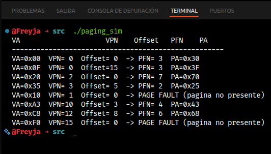

### 5.3 Simulador — Análisis

**1. Salida completa del simulador:**

```
VA=0x00  VPN= 0  Offset= 0  -> PFN= 3  PA=0x30
VA=0x0F  VPN= 0  Offset=15  -> PFN= 3  PA=0x3F
VA=0x20  VPN= 2  Offset= 0  -> PFN= 7  PA=0x70
VA=0x35  VPN= 3  Offset= 5  -> PFN= 2  PA=0x25
VA=0x10  VPN= 1  Offset= 0  -> PAGE FAULT (pagina no presente)
VA=0xA3  VPN=10  Offset= 3  -> PFN= 4  PA=0x43
VA=0xC8  VPN=12  Offset= 8  -> PFN= 6  PA=0x68
VA=0xF0  VPN=15  Offset= 0  -> PAGE FAULT (pagina no presente)
```

**2. ¿Qué ocurre con 0x10 y 0xA3? ¿Qué haría el SO ante un page fault?**

- `0x10`: VPN = 1, y en la tabla `page_table[1] = -1` → **PAGE FAULT**, la página virtual 1 no está mapeada.
- `0xA3`: VPN = 10, `page_table[10] = 4` → traducción exitosa, PA = 0x43. No hay fallo.

Cuando ocurre un page fault de verdad, el SO hace lo siguiente: suspende el proceso, busca la página en el disco (en el área de swap o en el archivo ejecutable si es código), encuentra un marco libre en RAM, copia la página ahí, actualiza la PTE con el PFN nuevo y pone el bit Valid en 1, y por último retoma la instrucción que generó el fallo. Para el proceso es transparente: él no se da cuenta de nada, solo siente que la instrucción tardó más.

**3. ¿Cuántos accesos a memoria física necesita un load con tabla de un nivel? ¿Por qué es costoso?**

Con tabla de un solo nivel se necesitan **2 accesos a memoria** por cada load:

1. Primero leer la PTE en la tabla de páginas para sacar el PFN.
2. Después leer el dato en la dirección física resultante.

Esto literalmente duplica el costo de cualquier acceso a memoria, lo que es brutal en términos de performance. La solución de hardware es el **TLB** (*Translation Lookaside Buffer*), que es un caché de traducciones recientes. Cuando hay TLB hit no se necesita el primer acceso, el PFN se entrega directamente desde el TLB.

**4. Ventaja de paginación sobre segmentación en cuanto a fragmentación:**

La paginación elimina la fragmentación externa porque todas las páginas y todos los marcos tienen el mismo tamaño fijo. Cualquier marco libre sirve para cualquier página, no importa dónde esté en la memoria física. En segmentación, los segmentos tienen tamaños variables y al liberar memoria se forman huecos que no necesariamente sirven para el próximo segmento, lo que sí genera fragmentación externa.

Lo que sí tiene la paginación es **fragmentación interna**: el último marco de una región puede quedar parcialmente vacío, pero ese desperdicio es chico comparado con el problema de la fragmentación externa.

---

## 6. Gestión de Espacio Libre

### 6.1 Simulación de estrategias de asignación

La lista libre inicial era:

| Dirección inicio | Tamaño (bytes) |
|-----------------|----------------|
| 0x0100 | 100 |
| 0x0200 | 500 |
| 0x0400 | 200 |
| 0x0500 | 300 |
| 0x0700 | 600 |

Y las solicitudes a procesar en orden: `malloc(212)` · `malloc(417)` · `malloc(98)` · `malloc(426)`.

---

**1. First Fit:**

| Solicitud | Bloque elegido | Razón | Resto libre |
|-----------|---------------|-------|-------------|
| malloc(212) | 0x0200 (500 B) | primer bloque ≥ 212 | 0x02D4: 288 B |
| malloc(417) | 0x0700 (600 B) | primer bloque ≥ 417 | 0x08A1: 183 B |
| malloc(98)  | 0x0100 (100 B) | primer bloque ≥ 98  | 0x0162: 2 B   |
| malloc(426) | — | ningún bloque tiene ≥ 426 B | **FALLO** |

Lista libre tras las 4 solicitudes (first fit):
`[0x0162: 2 B]` · `[0x02D4: 288 B]` · `[0x0400: 200 B]` · `[0x0500: 300 B]` · `[0x08A1: 183 B]`

**2. Best Fit:**

| Solicitud | Bloque elegido | Razón | Resto libre |
|-----------|---------------|-------|-------------|
| malloc(212) | 0x0500 (300 B) | bloque más ajustado ≥ 212 | 0x05D4: 88 B |
| malloc(417) | 0x0200 (500 B) | bloque más ajustado ≥ 417 | 0x03A1: 83 B |
| malloc(98)  | 0x0100 (100 B) | bloque más ajustado ≥ 98  | 0x0162: 2 B  |
| malloc(426) | 0x0700 (600 B) | único bloque ≥ 426        | 0x08AA: 174 B |

Acá sí cambia el resultado: **best fit logra atender las 4 solicitudes**, mientras que first fit falla en la última.

**3. ¿Cuál estrategia genera más fragmentación externa?**

En este caso **first fit** genera más fragmentación externa. Al asignar el bloque de 500 B para satisfacer una solicitud de solo 212 B, deja un fragmento de 288 B "atrapado". Sumándole los demás bloques chicos, queda imposible atender malloc(426), aunque la memoria libre total (2 + 288 + 200 + 300 + 183 = 973 B) alcanzaría de sobra.

Best fit, por su parte, intenta dejar siempre el fragmento más pequeño posible al asignar, lo que en este caso conserva los bloques grandes para solicitudes futuras y minimiza el problema.

**4. ¿Qué es el coalescing? Caso donde su ausencia hace fallar una solicitud de 250 B:**

El *coalescing* es la operación en la que el allocator, cuando uno hace `free` de un bloque, revisa si los bloques vecinos también están libres y, si lo están, los une todos en un solo bloque más grande. Sin coalescing, los bloques contiguos libres quedan separados en la lista libre aunque físicamente estén pegados.

```
Sin coalescing — dos bloques adyacentes libres pero no fusionados:
[ libre: 150 B @ 0x0300 ][ libre: 150 B @ 0x0396 ]

malloc(250) → FALLO: ningún bloque individual tiene 250 B aunque
              entre ambos haya 300 B libres juntos en memoria.

Con coalescing — los bloques se fusionan al hacer free:
[ libre: 300 B @ 0x0300 ]

malloc(250) → ÉXITO.
```

**5. ¿Qué es la fragmentación interna? ¿Cuándo aparece con un slab allocator?**

La fragmentación interna ocurre cuando se le entrega al usuario un bloque más grande que el que pidió, y los bytes sobrantes adentro del bloque se quedan sin usar. Por ejemplo, si el allocator solo entrega bloques múltiplos de 16 y uno pide 10 bytes, le entrega un bloque de 16 y los 6 bytes extra se desperdician.

En el caso del *slab allocator* (que usa el kernel de Linux), la memoria se divide en caches de objetos de tamaño fijo. Si un objeto es más pequeño que el slot que tiene asignado en el slab, los bytes que quedan sin usar dentro del slot son fragmentación interna.

### 6.2 Programa de fragmentación — `fragmentation.c`

El programa asigna 10 bloques de tamaños distintos, libera los de índices pares (creando huecos intercalados con los bloques que siguen vivos) y al final intenta asignar un bloque grande de 1500 bytes para ver qué pasa.

```bash
gcc -Wall -o fragmentation fragmentation.c
./fragmentation
```

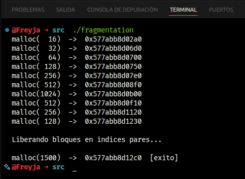

### 6.3 Fragmentación en glibc — Análisis

**1. ¿Son consecutivas las direcciones? ¿Qué patrón de separación se observa?**

No son estrictamente consecutivas pero sí siguen un patrón muy regular. La separación entre dos bloques contiguos es `tamaño_solicitado + 16 bytes` de overhead. Por ejemplo:

- malloc(32) → 0x...06D0; malloc(64) → 0x...0700: diferencia = 0x30 = 48 = 32 + 16.
- malloc(64) → 0x...0700; malloc(128) → 0x...0750: diferencia = 0x50 = 80 = 64 + 16.

Esos 16 bytes corresponden al encabezado de chunk que glibc mantiene antes de cada bloque, donde guarda el tamaño y unos flags de uso. Es la metadata interna del allocator.

**2. ¿Tiene éxito malloc(1500)? Explicación en términos de fragmentación:**

Sí, `malloc(1500)` tuvo éxito (el programa imprime `[exito]`). En principio uno esperaría que fallara: los bloques que liberé son los de índices pares (16, 64, 256, 1024, 256 bytes), pero como están separados por bloques que siguen ocupados, glibc no los puede fusionar por coalescing.

La razón por la que igual tiene éxito es que el allocator de glibc no se queda solo con la lista libre interna: cuando no encuentra un bloque suficientemente grande, simplemente le pide más memoria al SO mediante `sbrk()` o `mmap()`. Por eso la asignación funciona aunque haya fragmentación interna en el heap actual. Para que realmente fallara habría que tener un allocator con un pool de memoria fijo, sin posibilidad de pedir más al SO, como suele pasar en sistemas embebidos.

**3. ¿Cuál es la diferencia entre el allocator de usuario (malloc/glibc) y el del kernel (buddy/slab)?**

| | Allocator de usuario (glibc/malloc) | Allocator del kernel (buddy/slab) |
|---|---|---|
| **Opera sobre** | El heap del proceso, en espacio de usuario | La memoria física del sistema |
| **Unidad mínima** | Bytes (con chunks que tienen overhead de 16 B) | Páginas de 4 KB (buddy) o slots de slabs (slab) |
| **Algoritmo** | Lista libre con coalescing (en glibc se llama ptmalloc) | Buddy system para páginas; slab para objetos del kernel |
| **Cómo se usa** | `malloc`/`free` desde el código del programa | `kmalloc`/`kfree` desde código del kernel |

Existen dos niveles porque las necesidades son completamente distintas. El kernel tiene que gestionar páginas físicas reales, con alineamiento estricto y posibilidad de acceso al hardware. Las aplicaciones de usuario, en cambio, necesitan asignar muchos objetos chiquitos y rápido, sin tener que entrar al modo kernel cada vez. El allocator de usuario funciona como un intermediario: pide al kernel páginas grandes en pocos llamados y luego internamente las divide en chunks pequeños para los `malloc` del programa.

---

## 7. TLBs — Translation Lookaside Buffer

### 7.0 Benchmark de localidad — `tlb_locality.c`

El programa compara cuánto tarda sumar 4M enteros (16 MB en total) accediéndolos en orden secuencial vs en orden aleatorio (con un shuffle de Fisher-Yates). Se compila con `-O0` para que el compilador no haga optimizaciones que eliminen los accesos a memoria, porque si los hace el experimento pierde sentido.

```bash
gcc -O0 -o tlb_locality tlb_locality.c
./tlb_locality
```

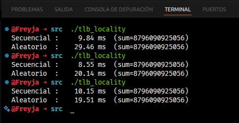

### 7.1 Localidad y TLB — Análisis

**1. ¿Cuántas veces más lento es el acceso aleatorio? Promedio de 3 ejecuciones:**

| Ejecución | Secuencial (ms) | Aleatorio (ms) |
|-----------|-----------------|----------------|
| 1 | 9.84 | 29.46 |
| 2 | 8.55 | 20.14 |
| 3 | 10.15 | 19.51 |
| **Promedio** | **9.51 ms** | **23.04 ms** |

El acceso aleatorio resulta **2.42× más lento** que el secuencial.

**2. ¿Por qué el acceso aleatorio es más lento, según el modelo del TLB?**

En el acceso secuencial, los elementos del arreglo se leen en orden de memoria. Como una página de 4 KB tiene espacio para 1024 enteros, el TLB solo tiene que generar una traducción nueva cada 1024 accesos: el *hit rate* queda casi en 100%, y el costo de la traducción es prácticamente cero.

En el acceso aleatorio, cada índice cae en una página totalmente impredecible. El arreglo ocupa 4096 páginas (16 MB / 4 KB), pero un TLB típico tiene unas 64 entradas, o sea que cubre menos del 2% del arreglo. La gran mayoría de accesos genera *TLB miss*, lo que obliga al hardware a hacer un *page table walk* en RAM (un acceso extra a memoria por cada acceso del programa). Eso es lo que se ve en el tiempo: el costo extra de las traducciones que no caben en el TLB.

**3. Si el tamaño de página fuera 64 KB en lugar de 4 KB, ¿mejora o empeora el acceso aleatorio?**

Mejoraría, aunque moderadamente. Con páginas de 64 KB el arreglo de 16 MB ocuparía solo 256 páginas (en vez de 4096). Un TLB de 64 entradas estaría cubriendo el 25% del arreglo, lo que aumenta bastante la probabilidad de TLB hit incluso con accesos aleatorios. Aún así, como el patrón sigue siendo impredecible, va a haber muchos misses; no es la solución mágica.

La contrapartida es la fragmentación interna: procesos que usen poca memoria desperdiciarían hasta 63 KB por cada región chiquita que asignen. Para el acceso secuencial casi no aporta, porque con páginas de 4 KB el hit rate ya es altísimo.

### 7.2 Comportamiento de los TLB

**1. Un TLB con 64 entradas y páginas de 4 KB: ¿cuánta memoria cubre sin misses? ¿Es suficiente?**

```
64 entradas × 4 KB/página = 256 KB
```

Un proceso moderno típico fácilmente usa cientos de MB (entre código del programa, stack, heap, librerías compartidas como libc, etc), entonces 256 KB se queda muy corto para cubrir el *working set*. Los TLB misses son inevitables. Por eso los procesadores actuales compensan con TLBs multinivel (un L1-TLB chiquito y rápido, y un L2-TLB más grande) y soporte para páginas grandes (2 MB y 1 GB en x86-64) que aumentan brutalmente la cobertura.

**2. ¿Qué es un TLB shootdown? ¿Cuándo ocurre y por qué es costoso?**

Cuando un proceso modifica su tabla de páginas (por ejemplo cuando libera memoria con `munmap`), las CPUs que están corriendo ese mismo proceso pueden tener cacheada la traducción vieja en sus TLBs locales. El kernel tiene que invalidar esas entradas en *todos* los núcleos antes de que sigan usando la traducción incorrecta. Para hacer eso, manda una IPI (*Inter-Processor Interrupt*) a todos los núcleos, obligándolos a interrumpir su trabajo y ejecutar una instrucción tipo `INVLPG` o un flush completo del TLB. A esa operación se le llama TLB shootdown.

Es costosa porque requiere sincronización global: el núcleo que inició el cambio tiene que esperar a que todos los demás confirmen que ya invalidaron sus TLBs antes de seguir adelante. En sistemas con muchos núcleos o cargas que hacen mucho `mmap`/`munmap`, los shootdowns pueden volverse un cuello de botella real.

**3. TLB gestionado por hardware (CISC/x86) vs gestionado por software (RISC/MIPS):**

En el modelo **hardware** (típico de x86), cuando hay un TLB miss el procesador automáticamente recorre la tabla de páginas (esto se llama *page table walk*) y carga la traducción nueva en el TLB sin que el SO se entere. Es transparente, pero obliga a que el SO mantenga la tabla de páginas exactamente en el formato que el hardware espera; no hay flexibilidad.

En el modelo **software** (típico de MIPS y otros RISC), un TLB miss dispara una excepción y el hardware salta a un handler del SO. Ahí el SO decide cómo encontrar la traducción y cómo cargarla en el TLB manualmente. Esto le da al diseñador del SO **mucha más flexibilidad**: puede usar cualquier estructura de tabla de páginas que quiera (multinivel, invertida, hash) e implementar políticas personalizadas. El precio es que el handler del SO se ejecuta en cada miss, así que tiene que estar muy bien optimizado para no destrozar el rendimiento.

---

## Problemas encontrados y soluciones

**1. Confusión al interpretar la salida de `/proc/maps`**

Cuando corrí por primera vez el `cat /proc/.../maps` en la sección 1, me confundió ver que el ejecutable `mem_map` aparecía con varias entradas distintas y con permisos diferentes (`r--p`, `r-xp`, `rw-p`), en vez de una sola entrada como esperaba. Pensé que era un error o que estaba leyendo mal la salida. Buscando en internet y preguntándole a Claude entendí que el linker divide el binario ELF en secciones con permisos distintos y el kernel las mapea por separado: la sección `.text` (código ejecutable) tiene `r-xp`, la sección `.rodata` (constantes) tiene `r--p` y la sección `.data` (variables globales modificables) tiene `rw-p`. No es ningún error, es algo intencional por seguridad para poder aplicar protecciones distintas a cada parte del binario.

**2. Error al traducir el Stack en segmentación**

En la sección 4, al traducir la VA `0x3C00` del Stack la primera vez calculé `PA = base + offset = 0x2800 + 0xC00 = 0x3400`, que es lo que uno haría con la fórmula normal. Cuando comparé con un ejemplo similar que encontré en internet vi que el resultado no coincidía. Investigando más y revisando varias fuentes y explicaciones, me di cuenta que el stack crece negativo, así que la fórmula no es la misma: hay que restar el tamaño máximo del segmento. Una vez que ajusté la fórmula a `PA = base + offset − tamaño_máximo` me dio 0x2400, que es el valor correcto. Es un detalle chiquito pero si no lo tienes claro fácilmente das con el resultado equivocado.

**3. `malloc(1500)` no falló como yo esperaba**

En la sección 6, después de hacer todos los frees de los índices pares en `fragmentation.c`, esperaba que el `malloc(1500)` final fallara o por lo menos diera un puntero raro, porque ningún hueco individual era suficientemente grande para 1500 bytes. Cuando vi que devolvió un puntero válido ([exito]) me confundí bastante. Investigando entendí que glibc no se limita a la lista libre actual: cuando no encuentra espacio suficiente, le pide más memoria al SO directamente con `sbrk()` o `mmap()`. O sea que es muy difícil hacer fallar un `malloc` real desde código de aplicación, porque siempre queda la salida de pedir más memoria. Para reproducir el escenario de "fallo por fragmentación" tendría que estar usando un allocator con memoria fija como los que se usan en sistemas embebidos.

---

## Conclusiones

1. **La virtualización de memoria es una ilusión muy bien construida.** Antes de hacer este lab pensaba que las direcciones que se imprimen en C son las direcciones reales en RAM. Ver con mis propios ojos en `/proc/maps` que dos procesos del mismo programa tienen la misma estructura de regiones pero direcciones distintas (por el ASLR) y entender que cada VA se traduce a una PA diferente, hace mucho más concreto lo que en clase suena medio abstracto. El SO y la MMU están haciendo trabajo en cada acceso a memoria sin que el programa se entere de nada.

2. **Valgrind es una herramienta que debería ser de uso diario.** Lo más impactante de la sección 2 fue darme cuenta que el programa con bugs (`buggy_mem`) corre sin crash en muchas ejecuciones a pesar de tener buffer overflow y use-after-free. Es decir, sin una herramienta como Valgrind esos errores podrían pasar desapercibidos en pruebas normales y solo manifestarse después en producción de la peor manera posible. Quedé convencido de que Valgrind no debería usarse solo cuando algo se rompe, sino como parte del flujo normal de desarrollo en C.

3. **Cada mecanismo de gestión de memoria es una respuesta a las limitaciones del anterior.** Lo que más me ayudó a entender la materia fue ver en orden cómo evoluciona la solución: base & bounds es fácil pero rígido y desperdicia mucha RAM; segmentación lo flexibiliza pero introduce fragmentación externa; paginación elimina la fragmentación externa pero genera tablas de páginas enormes; las tablas multinivel y los TLB resuelven a su vez ese problema. No son ideas independientes, son una conversación entre soluciones a través de los años.

4. **El TLB es lo que hace que la paginación sea viable en el mundo real.** Los números del benchmark `tlb_locality` lo dejan súper claro: el acceso aleatorio es 2.4 veces más lento que el secuencial, y la única diferencia real es la cantidad de TLB misses. Esto cambió mi forma de pensar la localidad espacial: no es solo una recomendación de "buenas prácticas" sino algo que tiene un costo medible en milisegundos. Cosas como recorrer matrices por filas en vez de columnas de pronto dejan de ser detalles y pasan a ser decisiones de rendimiento importantes.

5. **La gestión de memoria opera en dos niveles que es importante no confundir.** Durante la práctica me dí cuenta que tendía a pensar `malloc` como si hablara directo con la RAM física, pero no es así. glibc administra un pool propio en espacio de usuario que obtiene del kernel en bloques grandes, y solo cuando se queda sin espacio le pide más al SO. El kernel por su parte solo ve páginas, no bloques de bytes. Entender esa separación explica cosas que al principio parecían raras, como que `malloc(1500)` no fallara aunque el heap aparentemente estuviera fragmentado.

6. **Calcular cosas a mano es lo que realmente fija los conceptos.** Leer sobre selectores, offsets y crecimiento negativo del stack en cualquier explicación de internet siempre se sintió abstracto y como que se me olvidaba al rato. Pero hacer las cinco traducciones manuales de la sección 4, equivocarme en la del stack y tener que volver a entender la fórmula, fue lo que finalmente me hizo entender el mecanismo de verdad. Lo mismo con calcular que un proceso de 32 bits necesita 4 MB solo para su tabla de páginas: ahí queda claro por qué los SO modernos tienen que usar tablas multinivel; no es un capricho de diseño.

---

## Manifiesto de transparencia

Para este lab usé herramientas de IA generativa, principalmente Claude, como apoyo para entender los conceptos más complejos y resolver dudas que iban saliendo durante la práctica. Específicamente, las usé para entender el funcionamiento del TLB en más detalle, la fórmula de traducción del stack en segmentación (que al principio me confundió), y la diferencia entre los allocators de usuario y del kernel.

Además consulté internet (Stack Overflow, blogs técnicos y la documentación de glibc) cuando necesitaba aclarar dudas puntuales, como el formato de las entradas de `/proc/maps` o cómo se comporta `sbrk` cuando el heap está fragmentado.

También usé a Claude como apoyo en la **redacción y reorganización del README**. La primera versión que armé tenía toda la información pero estaba muy desordenada, con bloques largos sin separar y respuestas que se mezclaban entre sí, así que era difícil de leer y de seguir. Le pedí que me ayudara a estructurarlo mejor por títulos y subtítulos, a separar cada pregunta de cada actividad de forma más clara, y a mejorar la redacción para que el documento se leyera más limpio sin cambiar el contenido técnico.

Todos los programas fueron escritos, compilados y ejecutados por mí en mi propia máquina. Las respuestas a las preguntas las redacté con base en lo que aprendí mientras hacía la práctica y verificando con los resultados reales que iban arrojando los programas.
